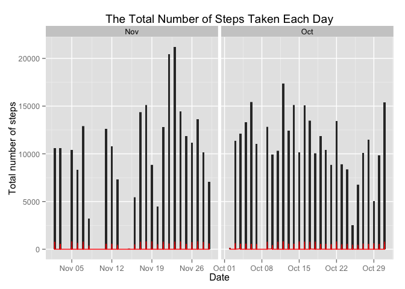
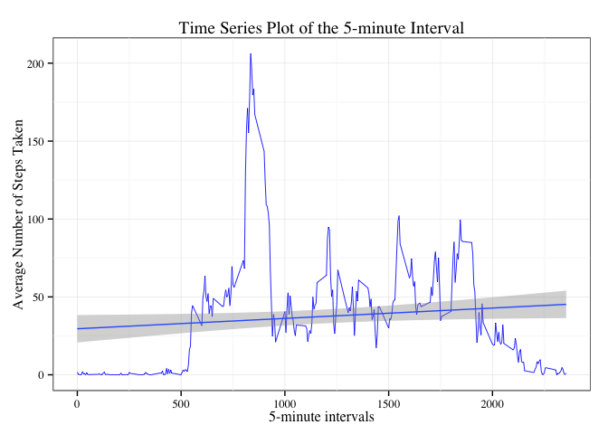
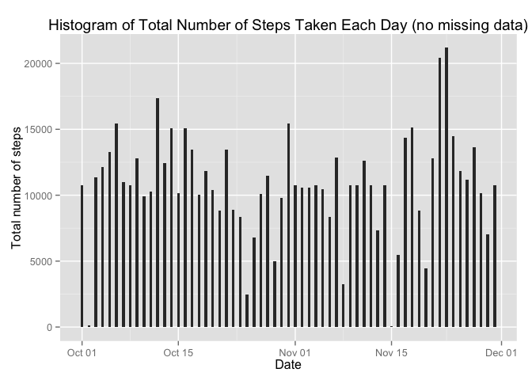
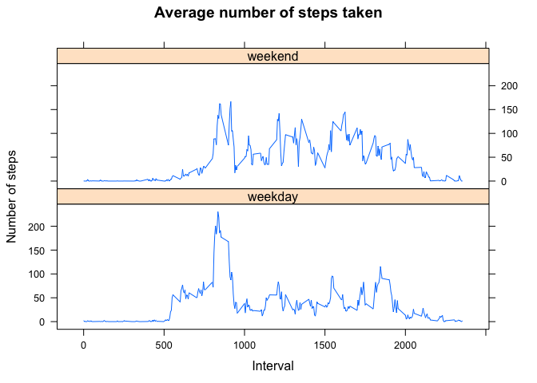

# Reproducible Research: Peer Assessment 1


## Loading and preprocessing the data
1. Load the data (i.e. `read.csv()`)

```r
unzip("/Users/alex/Documents/R directory/RepData_PeerAssessment1/activity.zip",exdir="./RepData_PeerAssessment1/")
```
2. Process/transform the data (if necessary) into a format suitable for your analysis

```r
data <- read.csv("/Users/alex/Documents/R directory/RepData_PeerAssessment1/activity.csv", colClasses=c("integer","Date","integer"))
```


## What is mean total number of steps taken per day?

For this part of the assignment, you can ignore the missing values in
the dataset.

```r
data_cl <- na.omit(data)
rownames(data_cl) <- 1:nrow(data_cl)
```

1. Make a histogram of the total number of steps taken each day

```r
library(ggplot2) 
data_cl$month <- format(data_cl$date, "%b")

ggplot(data_cl,aes(date,steps)) +
    geom_bar(stat="identity", width=.4)  + 
        scale_fill_distiller(palette = "Spectral", trans = "reverse") +
            geom_line(colour="red") +
                facet_grid(.~month,scales = "free") +
                    xlab("Date") + 
                        ylab("Total number of steps") +
                            ggtitle("The Total Number of Steps Taken Each Day")
```

 

2. Calculate and report the **mean** and **median** total number of steps taken per day

* Mean total number of steps taken per day:

```r
meanData <- tapply(data_cl$steps,data_cl$date,sum)
mean(meanData)
```

```
## [1] 10766.19
```
* Mean total number of steps taken per day :

```r
median(meanData)
```

```
## [1] 10765
```
## What is the average daily activity pattern?
1. Make a time series plot (i.e. `type = "l"`) of the 5-minute interval (x-axis) and the average number of steps taken, averaged across all days (y-axis)

```r
avgDaily <- as.data.frame(tapply(data_cl$steps,data_cl$interval,mean))
    avgDaily$interval <- rownames(avgDaily)
        rownames(avgDaily) <- 1:nrow(avgDaily)
            names(avgDaily)[1] <- "steps"

avgDaily[,2] <- as.numeric(avgDaily[,2])

ggplot(avgDaily,aes(interval,steps)) +
    geom_line(colour="blue",size=.3) +
     geom_smooth(method="lm") +
        labs(title = "Time Series Plot of the 5-minute Interval", x = "5-minute intervals", y = "Average Number of Steps Taken") +
            theme_bw(base_family="Times") +
                theme(panel.background = element_rect(fill="white",colour = 'black'))
```

 
2. Which 5-minute interval, on average across all the days in the dataset, contains the maximum number of steps?

```r
avgDaily$interval[which(avgDaily$steps==max(avgDaily$steps))]
```

```
## [1] 835
```

## Imputing missing values
Note that there are a number of days/intervals where there are missing
values (coded as `NA`). The presence of missing days may introduce
bias into some calculations or summaries of the data.

1. Calculate and report the total number of missing values in the dataset (i.e. the total number of rows with `NA`s)

```r
sum(is.na(data))
```

```
## [1] 2304
```
2. Devise a strategy for filling in all of the missing values in the dataset. The strategy does not need to be sophisticated. For example, you could use the mean/median for that day, or the mean for that 5-minute interval, etc.

* Missing values in the table will be replaced with the daily average number of steps taken. The values will be taken from the table created in the previous section.

3. Create a new dataset that is equal to the original dataset but with the missing data filled in.


```r
filledData <- data
for(i in 1:nrow(filledData)) {
    if(is.na(filledData$steps[i])) {
        filledData$steps[i] <- avgDaily[which(avgDaily$interval==filledData$interval[i]),]$steps
    }
}
head(filledData,10)
```

```
##        steps       date interval
## 1  1.7169811 2012-10-01        0
## 2  0.3396226 2012-10-01        5
## 3  0.1320755 2012-10-01       10
## 4  0.1509434 2012-10-01       15
## 5  0.0754717 2012-10-01       20
## 6  2.0943396 2012-10-01       25
## 7  0.5283019 2012-10-01       30
## 8  0.8679245 2012-10-01       35
## 9  0.0000000 2012-10-01       40
## 10 1.4716981 2012-10-01       45
```

```r
summary(filledData)
```

```
##      steps             date               interval     
##  Min.   :  0.00   Min.   :2012-10-01   Min.   :   0.0  
##  1st Qu.:  0.00   1st Qu.:2012-10-16   1st Qu.: 588.8  
##  Median :  0.00   Median :2012-10-31   Median :1177.5  
##  Mean   : 37.38   Mean   :2012-10-31   Mean   :1177.5  
##  3rd Qu.: 27.00   3rd Qu.:2012-11-15   3rd Qu.:1766.2  
##  Max.   :806.00   Max.   :2012-11-30   Max.   :2355.0
```
4. Make a histogram of the total number of steps taken each day. 

```r
dataHist <- as.data.frame(tapply(filledData$steps,filledData$date,sum))
    dataHist$date <- rownames(dataHist)
        rownames(dataHist) <- 1:nrow(dataHist)
            dataHist$date <- as.Date(dataHist$date)
                names(dataHist)[1] <- "steps"
ggplot(dataHist,aes(date,steps)) +
    geom_bar(stat="identity", width=.4) +
        labs(title = "Histogram of Total Number of Steps Taken Each Day (no missing data)", x = "Date", y = "Total number of steps")
```

 

5. Calculate and report the **mean** and **median** total number of steps taken per day. 
 
* Mean total number of steps taken per day

```r
mean(dataHist$steps)
```

```
## [1] 10766.19
```
* Median total number of steps taken per day

```r
median(dataHist$steps)
```

```
## [1] 10766.19
```

* Do these values differ from the estimates from the first part of the assignment? What is the impact of imputing missing data on the estimates of the total daily number of steps?

```r
oldData <- as.data.frame(tapply(data_cl$steps,data_cl$date,sum))
    oldData$date <- rownames(oldData)
        rownames(oldData) <- 1:nrow(oldData)
            names(oldData)[1] <- "steps"
            oldData$steps <- as.numeric(oldData$steps)
library(scales)
percent(mean(dataHist$steps) / mean(oldData$steps))
```

```
## [1] "100%"
```

```r
percent(median(dataHist$steps)  / median(oldData$steps))
```

```
## [1] "100%"
```

```r
mean(dataHist$steps) - mean(oldData$steps)
```

```
## [1] 0
```

```r
median(dataHist$steps) - median(oldData$steps)
```

```
## [1] 1.188679
```
* The result shows while the **mean** stayed unchanged, the **median** increased slightly.
    
## Are there differences in activity patterns between weekdays and weekends?
For this part the `weekdays()` function may be of some help here. Use
the dataset with the filled-in missing values for this part.

1. Create a new factor variable in the dataset with two levels -- "weekday" and "weekend" indicating whether a given date is a weekday or weekend day.

```r
filledData$day <- weekdays(filledData$date)
    levels(filledData$day)
```

```
## NULL
```

```r
filledData$day <- factor(format(filledData$date, "%A"))
levels(filledData$day) <- list(weekday = c("Monday", "Tuesday",
                                             "Wednesday", 
                                             "Thursday", "Friday"),
                                 weekend = c("Saturday", "Sunday"))
    levels(filledData$day)
```

```
## [1] "weekday" "weekend"
```
2. Make a panel plot containing a time series plot (i.e. `type = "l"`) of the 5-minute interval (x-axis) and the average number of steps taken, averaged across all weekday days or weekend days (y-axis). 

```r
newData <- aggregate(filledData$steps, 
                      list(interval = as.numeric(filledData$interval), 
                           day = filledData$day), 
                            mean)
names(newData)[3] <- "steps"

library(lattice)
xyplot(newData$steps ~ newData$interval | newData$day, 
       layout = c(1, 2), 
         type = "l", 
            xlab = "Interval", 
                ylab = "Number of steps", 
                  main="Average number of steps taken")
```

 
